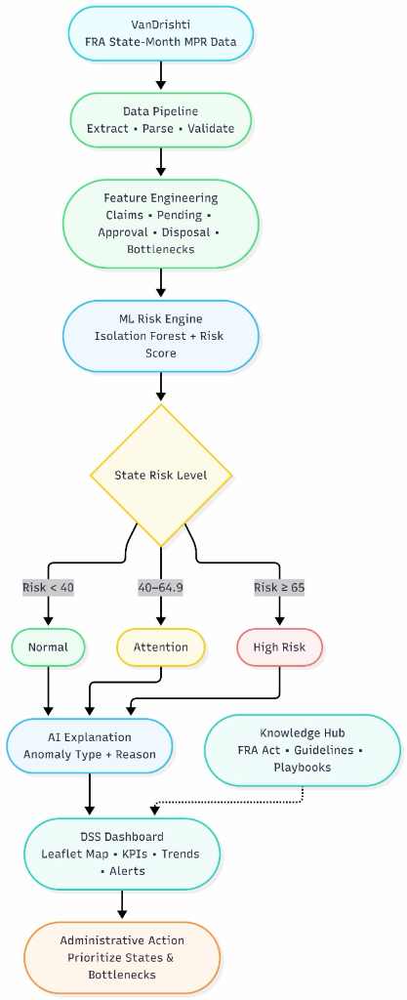

# VanRakshak: Forest Rights Act (FRA) Decision Support System

VanRakshak is an open-source, multi-layered Decision Support System (DSS) engineered to provide end-to-end monitoring, anomaly detection, and workflow bottleneck analysis for the implementation of the Forest Rights Act (FRA) across Indian states. The platform operates on a dual-interface model: a comprehensive geospatial dashboard for state-wise KPI tracking and an integrated AI assistant for proactive knowledge dissemination and anomaly explanations.

---

## Table of Contents

- [1. Executive Summary](#1-executive-summary)
- [2. System Architecture](#2-system-architecture)
  - [2.1 High-Level Architectural Flow](#21-high-level-architectural-flow)
- [3. Core Subsystems and Agent Specifications](#3-core-subsystems-and-agent-specifications)
  - [3.1 Data Extraction and Validation Pipeline](#31-data-extraction-and-validation-pipeline)
  - [3.2 ML Risk and Anomaly Engine](#32-ml-risk-and-anomaly-engine)
  - [3.3 Geospatial DSS Dashboard](#33-geospatial-dss-dashboard)
  - [3.4 Knowledge Hub & AI Assistant](#34-knowledge-hub--ai-assistant)
- [4. Repository Structure](#4-repository-structure)
- [5. Technology Stack](#5-technology-stack)
- [6. API Reference](#6-api-reference)
- [7. Installation and Local Setup](#7-installation-and-local-setup)
- [8. License](#8-license)

---

## 1. Executive Summary

VanRakshak unifies diverse state-level Monthly Progress Reports (MPRs) and geospatial data into an orchestrated operating system for tribal and forest rights management. Traditional monitoring tools suffer from fragmented reporting and delayed bottleneck detection. VanRakshak mitigates these challenges through:

1. **Automated Document Parsing**: OCR and heuristic-based extraction of data from official PDF MPRs into structured state-wise pipelines.
2. **Machine Learning Risk Engine**: Deployment of Isolation Forest models to flag anomalies (e.g., unexpected rejection rate spikes or severe claim backlogs) and compute a definitive `State Risk Level`.
3. **Immersive Geospatial Interface**: A custom-built Leaflet-driven map dashboard with a dark atmospheric aesthetic for real-time visualization of claims, pending cases, and administrative prioritization.
4. **Contextual AI Explanations**: A simulated conversational AI assistant integrated directly into the dashboard to explain anomaly causes, provide FRA Act guidelines, and suggest administrative actions.

---

## 2. System Architecture

### 2.1 High-Level Architectural Flow

The platform's data and decision logic follow a sequential pipeline from raw MPR ingestion to administrative prioritization:



*   **Ingestion & Pipeline**: Processes State-Month MPR data into validated data structures.
*   **Feature Engineering**: Calculates metrics like Approval, Pending, Disposal, and Bottleneck rates.
*   **ML Risk Engine**: Feeds features into an Isolation Forest, yielding a Risk Score.
*   **Categorization**:
    *   *Normal (Risk < 40)*
    *   *Attention (Risk 40 - 64.9)*
    *   *High Risk (Risk >= 65)*
*   **Actionable Output**: Routes insights to the DSS Dashboard and AI Assistant for final Administrative Action.

---

## 3. Core Subsystems and Specifications

### 3.1 Data Extraction and Validation Pipeline
Parses diverse PDF layouts from statutory MPRs. Handles OCR discrepancies, merges data across 18 months, and normalizes nomenclature across states and union territories.

### 3.2 ML Risk and Anomaly Engine
Uses an `Isolation Forest` (`isolation_forest_model.pkl`) to identify statistically significant deviations in processing speed, rejection rates, and pending backlogs, scoring states on a 0-100 risk scale.

### 3.3 Geospatial DSS Dashboard
A React + Vite + Tailwind CSS frontend featuring a Leaflet map. States are color-coded based on their ML-derived risk levels. Users can filter by month and view detailed KPIs.

### 3.4 Knowledge Hub & AI Assistant
A built-in interactive chat widget providing domain knowledge on the Forest Rights Act (2006) and deforestation awareness, cross-referencing playbooks, and guidelines stored in the `static/documents` Knowledge Hub.

---

## 4. Repository Structure

```text
TechHunters/
├── main.py                               # FastAPI backend DSS server & API endpoints
├── processed_fra_predictions.csv         # ML predictions & state dataset (used by main.py)
├── india_states.geojson                  # GIS boundaries for India states
├── isolation_forest_model.pkl            # Trained ML Isolation Forest model
├── feature_config.json                   # ML feature configuration
├── build_fra_dataset.py                  # Core dataset builder
├── extract_master_18_months.py           # Data extraction engine
├── train_model.py                        # Isolation Forest model trainer
├── static/                               # Statutory documents, images & flowchart
├── templates/                            # Index & landing HTML templates
├── vandhristi-2/                         # Full React + Vite + TypeScript web application
│   ├── client/src/components/            # UI Components (Map, AI Assistant, Layouts)
│   ├── client/public/                    # Public web assets
│   └── package.json                      # Frontend dependencies
└── README.md                             # Project documentation
```

---

## 5. Technology Stack

*   **Backend & Data Processing**: Python, FastAPI, Pandas, Uvicorn
*   **Machine Learning**: Scikit-Learn (Isolation Forest)
*   **Frontend Ecosystem**: React 18, Vite, TypeScript, Tailwind CSS, Wouter (Routing)
*   **Geospatial**: Leaflet, React-Leaflet, GeoJSON
*   **UI Assets**: Lucide React, Radix UI Primitives

---

## 6. API Reference

The FastAPI backend exposes the following primary endpoints on port `8000`:

*   `GET /api/fra/months` - Returns a sorted list of all available YYYY-MM periods in the processed dataset.
*   `GET /api/fra/states?month={YYYY-MM}` - Returns state-wise FRA implementation metrics, ML risk scores, and anomaly categorizations for the requested month.
*   `GET /api/fra/geojson` - Serves the `india_states.geojson` file for frontend map rendering.

---

## 7. Installation and Local Setup

### 7.1 Prerequisites
*   Python 3.9+
*   Node.js 18+ and npm

### 7.2 Backend Initialization
Navigate to the root directory, install Python dependencies (FastAPI, Uvicorn, Pandas, Scikit-learn), and start the server:
```bash
# Start the Uvicorn ASGI server
python -m uvicorn main:app --host 0.0.0.0 --port 8000
```
The API is now live at `http://localhost:8000`.

### 7.3 Frontend Initialization & Build
Open a new terminal window and navigate to the frontend workspace:
```bash
cd vandhristi-2

# Install dependencies
npm install

# Build the frontend assets for production
npm run build
```
Once built, the FastAPI server will automatically intercept root traffic and serve the production frontend. You can view the full application by visiting `http://localhost:8000/`.

---

## 8. License

This project is open-source and available under standard MIT License provisions.
